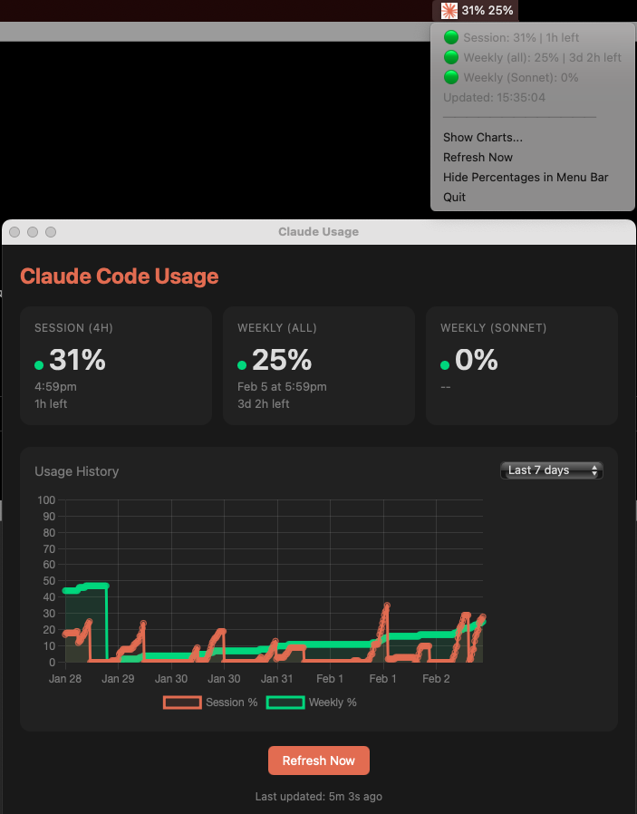

# CC Usage

macOS menu bar app showing Claude Code usage statistics.

## Features

- Real-time session and weekly usage percentages in the menu bar
- Color-coded pace indicators (green/yellow/orange/red)
- Historical usage charts
- No API keys required - uses tmux automation with the Claude CLI

## Setup

1. Build: `npm run build`
2. Create symlink: `npm run link`
3. Add to Login Items: System Settings > General > Login Items > add "Claude Usage"

See [CLAUDE.md](./CLAUDE.md) for development instructions.
